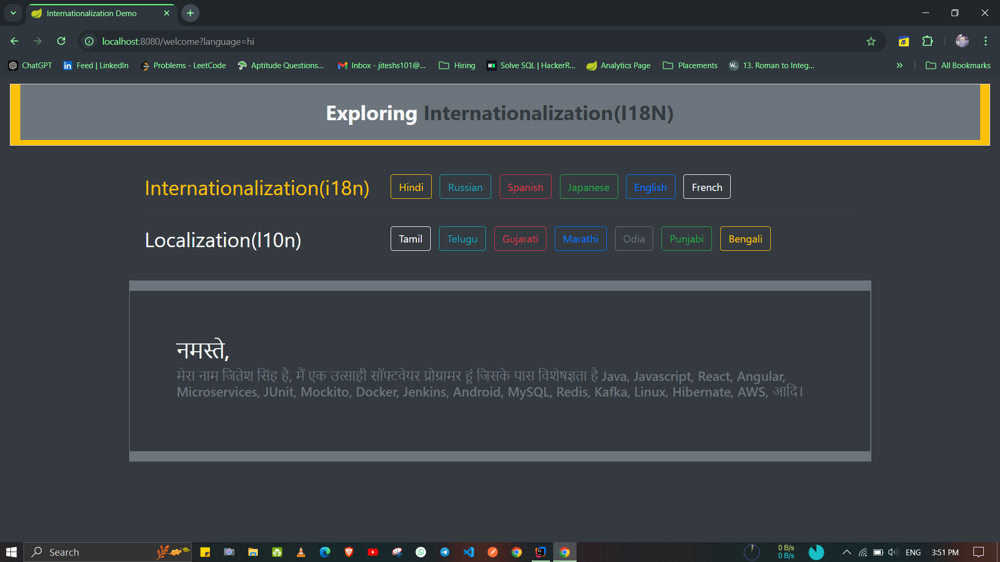
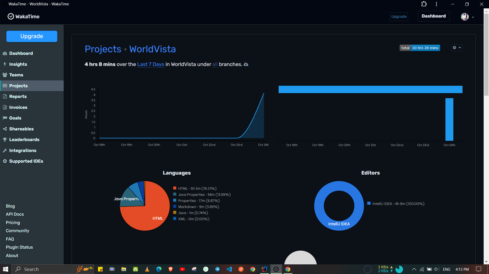

> # Project to Demonstrate the Internationalization(i18n) & Localization(L10N) 

- [Hosted](https://worldvista.koyeb.app/welcome/)
- [Wakatime Insights](https://wakatime.com/@Er_Jrsingh/projects/ktybjudpbk)

> Internationalization is a process that makes your application adaptable to different languages and regions without
> engineering changes on the source code. In other words, Internationalization is a readiness of Localization.

| Features
- Complete configuration to use  i18n & l10n in  Java
- Enriched UI using Bootstrap color only.
- Java8, Spring Boot,  Thymeleaf

> # SnapShot :-

> # Wakatime Report  :- 
